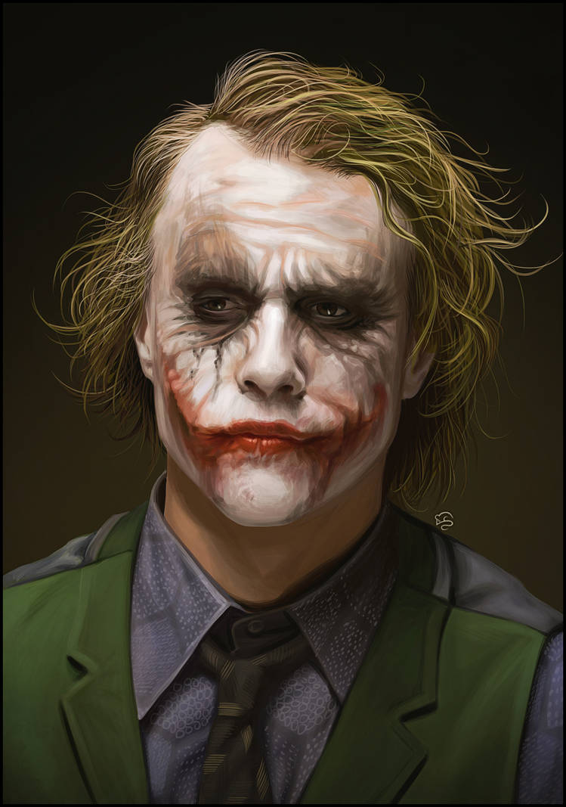
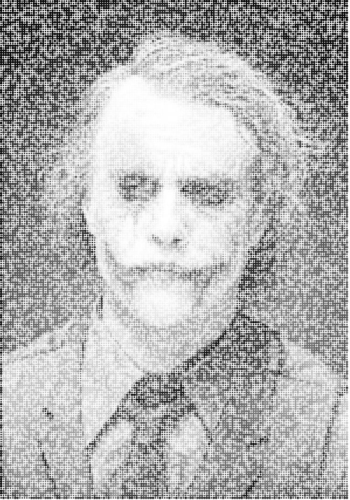

# Halftone_Image
A tiny python code to create a dotted grayscale (or so to speak a Halftone) image!

**Usage:**  
`$ python Halftone_Image.py <image_name> <pseudo_resolution>`

**Example:**  
`$ python Halftone_Image.py Joker.jpg 200`

---

